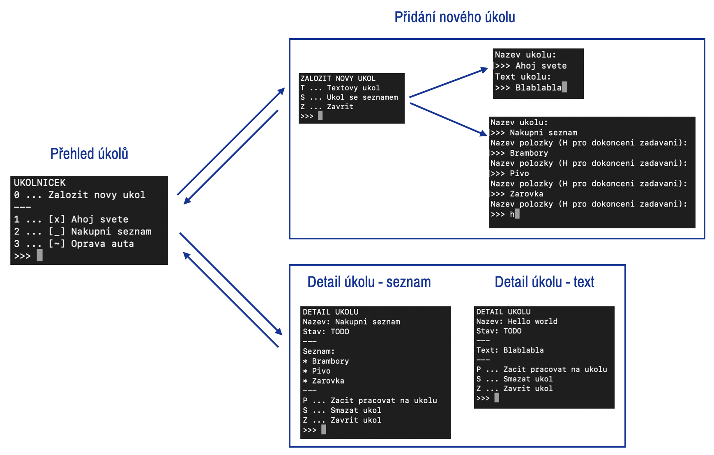

# TypeScript pro Angular - Cvičení 2 - Vylepšení úkolníčku

Naším cílem bude rozšířit úkolníček následujícím způsobem:
* Úkolníčem by měl pracovat se dvěma druhy úkolů - úkoly s textovým obsahem a úkoly se vnořeným seznamem.
* Úkoly by měly nově mít ternární stav - TODO -> Rozpracovaný -> Hotový.
* Nadále by mělo jít úkoly vytvářet a mazat.

V projektu je zapnut kompilační profil s Null Safety kontrolami.

## Dílčí práce k provedení

### 0. Pokud pokračujete v práci nad vlastním kódem z úlohy 1

1. Zkopírujte si do projektu `tsconfig.json` z adresáře tohoto projektu, aby se zaply Null Safety kontroly. Pokud se objeví chyby spojené s Null Safety, patřičně je vyřešte.
2. Odeberte všechny explicitní typy z kódu tak, aby byla na maximum využita typová inference (možná bude znovu potřeba vyřešit další Null Safety chyby).

### 1. Zaveďte entitě `Task` ternární stavovost `TODO`/`INPROGRESS`/`DONE`
* Pro implementaci stavovosti si můžete vybrat jak enumerát, tak string union.
* Nově by místo položky `complete: boolean` měla mít entita `Task` položku `state`, která bude nést stavovou informaci o úkolu.
* Upravte obrazovky úkolníčku tak, aby šlo mezi stavy přecházet dle průchodu `TODO` -> `INPROGRESS` -> `DONE`.

*Tip: Začněte změnou `interface Task` - díky tomu Vám TypeScript bude postupně zvýrazňovat místa, kde musíte provést změny.*

### 2. Zaveďte nové variace entity `Task` - `TaskWithText` a `TaskWithList`.
* `TaskWithText` by měl mít povinnou položku `text`, která ponese vnitřní text úkolu.
* `TaskWithList` by měl mít povinnou položku `list`, který bude typu `Array<string>`.
* Zastřešte `TaskWithText` a `TaskWithList` pod společný union typ `Task`.

### 3. Upravte obrazovky úkolníčku pro podporu `TaskWithText` a `TaskWithList`.
* Mělo by dojít k úpravě detailu úkolu - pravděpodobně to bude také vyžadovat implementaci typových predikátů pro rozlišování mezi `TaskWithText` a `TaskWithList`.
* Další dopad bude v obrazovce vytvoření úkolu a v metodě `createTask` třídy `TaskStorage`.

### Inspirace k úpravě obrazovek:

